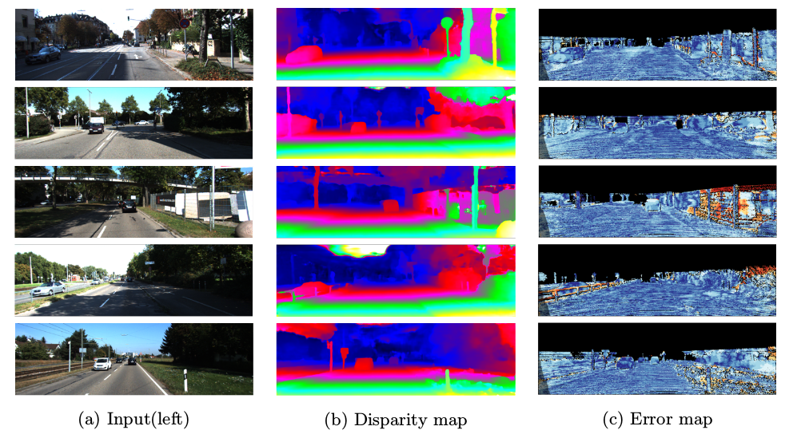
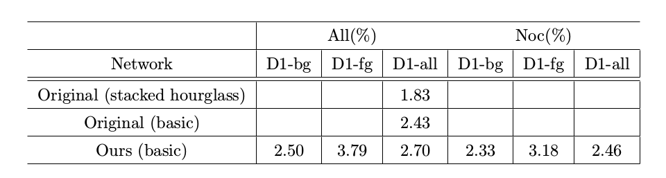

# Chainer-PSMNet
Chainer Reimplementation of [PSMNet (CVPR2018)](https://github.com/JiaRenChang/PSMNet)

## 1. Requirements
* Python 3.5
* Chainer 4.2.0
* ChainerCV 0.10.0
* NVIDIA Tesla P40 GPU * 2 (basic) 
* NVIDIA Tesla P40 GPU * 3 (Stacked hourglass)

## 2. Usage
### 2.1. Training
* SceneFlow
```
python main.py --datapath <Datapath> \
               --model_type basic \
               --gpu0 <GPU_num1> \
               --gpu1 <GPU_num2> \
               --resume <Snapshotpath> \
               --out <Outputpath>
```

* KITTI2015
```
python finetune.py --datapath <Datapath> \
                   --model_type basic \
                   --gpu0 <GPU_num1> \
                   --gpu1 <GPU_num2> \
                   --resume <Snapshotpath> \
                   --out <Outputpath> \
                   --model <Saved_modelpath>
```

### 2.2. Inference
* Sceneflow
```
python predict_sceneflow.py --datapath <Datapath> \
                            --gpu0 <GPU_num1> \
                            --gpu1 <GPU_num2> \
                            --model <Saved_modelpath>
```
* KITTI2015
```
python predict_kitti.py --datapath <Datapath> \
                        --gpu0 <GPU_num1> \
                        --gpu1 <GPU_num2> \
                        --model <Saved_modelpath>
```

## 3. Result
### 3.1. KITTI2015
* Disparity map



* Validation Error

